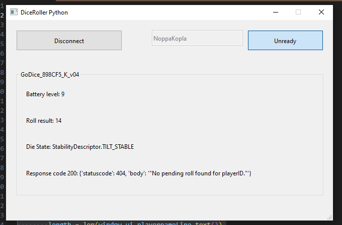

# DiceRollerPython
Companion App to send Dice roll values to AWS so Unity can fetch them via internet & local TCP-server to connect GoDice D20 bluetooth dice to [DiceRollers Unity project](https://github.com/Pyromaanisorsa/DiceRollers/tree/main) indirectly.
<br />- App created with PyQt and Qt Designer. Used to send GoDice roll values to AWS, which will be used to send the roll values to Unity via internet.
<br />- TCP server recycles app code (minus UI/PyQt code) and uses it to connect the dice and communicate with Unity via TCP protocol to send roll values to the game directly.
<br />More details how the AWS backend works with the app, check the Unity project repo's README.


<br />Figure: Screenshot of the app.

## 🧱 PyQt app / send values to Unity via AWS
The app connects GoDice to the app and then sends stable roll values to AWS when app is in ready state.

If you wanna modify the app I recommend running it in venv.
To modify the app code, modify app.py.
To modify the UI either:
1. Modify the DiceWindow.ui with Qt Designer and convert the .ui file to .py file with terminal command.
```
pyuic6 DiceWindow.ui -o DiceWindow.py
```
2. Modify the DiceWindow.py file directly.

How-to-use:
1. Start the app via terminal
```
python app.py
```
2. Connect your GoDice with Connect/Disconnect button, wait for dice to connect (Dice data will show on the app)
3. Type your username/playerID you typed in the game
4. Toggle ready state with Ready/Unready button when you want to send roll results to AWS
5. Roll the GoDice and it should send the roll value to AWS on stable roll
6. AWS returns HTTP response from Lambda function (no rollRequest currently, result sent successfully, error)

## 🕹️ TCP server / locally connecting dice to Unity
TCP server code (diceServer.py) has been packaged to single executable with PyInstaller and added to Unity project's Assets/StreamingAssets/diceServer folder.
godice_manager.py class instance connects the dice to the server and the server passes callback function that is run whenever a stable dice roll has been detected.
<br />How-it-works:
1. Unity starts the game and game start the server executable
2. Unity creates TCP connection to the server
3. Unity and server start to listen to each other's messages and react to them according to the message's 'type' field value (connect, disconnect, roll)
4. Dice rolls will be sent to Unity via callback function with 'type' field value 'roll' everytime stable roll is detected (Unity won't use the rolls in logic unless needed)
